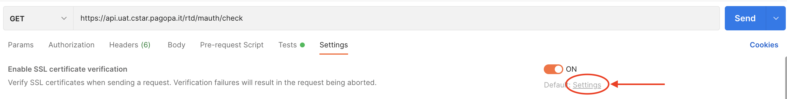
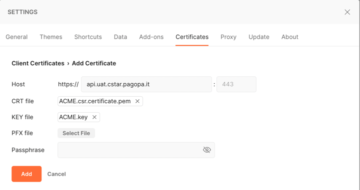
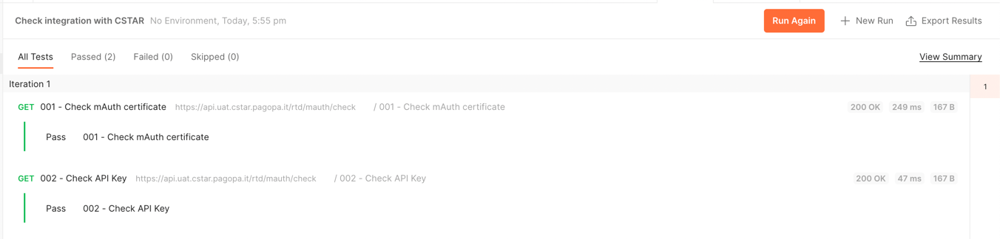

# CSTAR-CLI - Integration with CSTAR checks

In this file are documented the steps to follow in order to fulfill the first two steps of integration with CSTAR.

Every test results in either `PASS` (200 as response status) or `FAIL` (400 or 401 as response status).

Choose the tool you want to use to test API calls (Postaman or Bash) according to the capabilities of your system.

## Postman
The `postman` folder must be [imported as a collection in Postman](https://learning.postman.com/docs/getting-started/importing-and-exporting-data).

### Add mutual authentication certificate to Postman
To add the mutual authentication certificate to Postman you must follow the steps below:
- open any of the two endpoint calls inside the imported collection
- go to the "Settings" tab.
- click on "Settings" under the switch of the entry "Enable SSL certificate verification"
  


- go to the "Certificates" tab
- click on "Add Certificate" next to "Client Certificate" section
- insert `api.uat.cstar.pagopa.it` as the "Host" field
- pick the signed certificate (`*.pem`) file as "CRT file"
- pick the corresponding key file (`*.key`) file for the "KEY file"




### Set RTD API Key
To set the RTD API Key you must follow the steps below:
- click on the imported collection
- go to "Variables" tab
- populate the "API_KEY" INITIAL VALUE field with your API Key


- save the changes (click on the "Save" button with floppy icon).

### Run Postman collection
Right click on the collection and click "Run Collection".

Leave default values and run the collection with the button `Run Check integration...`

Check whether all the test are passed.



## Bash

## 1. Mutual Authentication certificate validity check

The first steps checks the validity of the client certificate.

This can be assessed with a call to an [enpoint](https://api.uat.cstar.pagopa.it/rtd/mauth/check) with a valid certificate and key.

From the project root run the script with the following command:
```bash
bash ./integration_check/scripts/001-mAuth-check/script.sh /PATH/TO/ACME.certificate.pem /PATH/TO/ACME.key
```
The execution will print the result of the check.

## 2. API Key validity check

The second steps checks the validity of the API Key.

This can be assessed with a call to an [enpoint](https://api.uat.cstar.pagopa.it/rtd/api-key/check) with a valid API Key.

From the project root run the script with the following command:
```bash
bash ./integration_check/scripts/002-API-key-check/script.sh /PATH/TO/ACME.certificate.pem /PATH/TO/ACME.key API_KEY
```
The execution will print the result of the check.